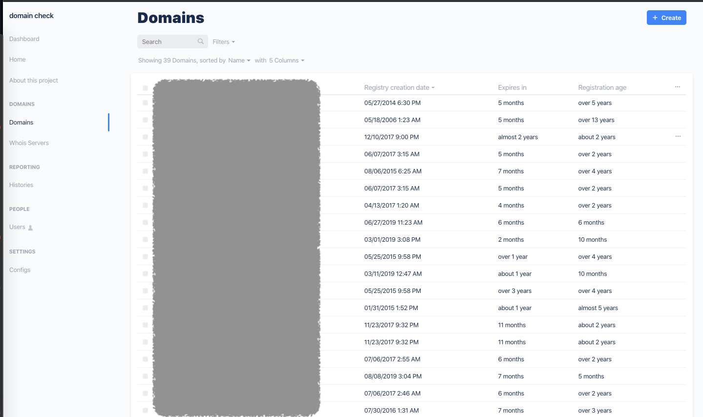

# Domain Manager

### Home View (current)

### Domains view

## Running the Project.

To run this project, open your terminal and run `yarn` within the Keystone project root to install all required packages, then run `yarn dev` form this folder to begin running Keystone.

The Keystone Admin UI is reachable from `localhost:3000/admin`. To log in, use the following credentials:

Username: `admin@mysupport.in`
Password: `<see .env>`
